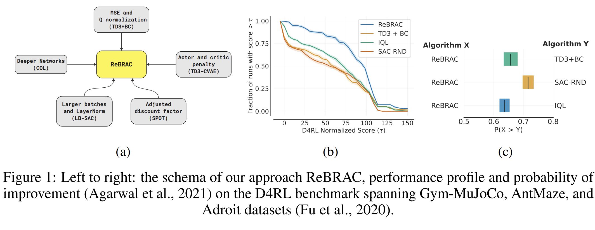

# Revisiting the Minimalist Approach to Offline Reinforcement Learning

[](https://arxiv.org/abs/1234.56789)



## Dependencies & Docker setup
To set up python environment (with dev-tools of your taste, in our workflow we use conda and python 3.8), 
just install all the requirements:

```commandline
python install -r requirements.txt
```

However, in this setup, you would also need to install mujoco210 binaries by hand. Sometimes this is not super straightforward,
but we used this recipe:
```commandline
mkdir -p /root/.mujoco \
    && wget https://mujoco.org/download/mujoco210-linux-x86_64.tar.gz -O mujoco.tar.gz \
    && tar -xf mujoco.tar.gz -C /root/.mujoco \
    && rm mujoco.tar.gz
export LD_LIBRARY_PATH=/root/.mujoco/mujoco210/bin:${LD_LIBRARY_PATH}
```
You may also need to install additional dependencies for mujoco_py. 
We recommend following the official guide from [mujoco_py](https://github.com/openai/mujoco-py).

### Docker

We also provide a simpler way, with a dockerfile that is already set up to work, all you have to do is build and run it :)
```commandline
docker build -t rebrac .
```
To run, mount current directory:
```commandline
docker run -it \
    --gpus=all \
    --rm \
    --volume "<PATH_TO_THE_REPO>:/workspace/" \
    --name rebrac \
    rebrac bash
```

### V-D4RL
In order to reproduce V-D4RL it is needed to be downloaded. Probably, the easiest way is to download it with the links below and unpack the archives.

* [walker_walk](https://drive.google.com/file/d/1F4LIH_khOFw1asVvXo82OMa2tZ0Ax5Op/view?usp=sharing)
* [cheetah_run](https://drive.google.com/file/d/1WR2LfK0y94C_1r2e1ps1dg6zSMHlVY_e/view?usp=sharing)
* [humanoid_walk](https://drive.google.com/file/d/1zTBL8KWR3o07BQ62jJR7CeatN7vb-vjd/view?usp=sharing)

Note, that provided  links contain only datasets reported in the paper without distraction and multitasking.

By default data is expected to be stored in the directory from which training script is called.

## How to reproduce experiments

### Training

Configs for the main experiments are stored in the `configs/rebrac/<task_type>` and `configs/rebrac-vis/<task_type>`. 
All available hyperparameters are listed in the `rebrac/algorithms/rebrac.py` for D4RL and `rebrac/algorithms/rebrac_torch_vis.py` for V-D4RL.

For example, to start ReBRAC training process with D4RL `halfcheetah-medium-v2` dataset, run the following:
```commandline
PYTHONPATH=. python3 src/algorithms/rebrac.py --config_path="configs/rebrac/halfcheetah/halfcheetah_medium.yaml"
```

For V-D4RL `walker_walk-expert-v2` dataset, run the following:
```commandline
PYTHONPATH=. python3 src/algorithms/rebrac_torch_vis.py --config_path="configs/rebrac-vis/walker_walk/expert.yaml"
```

To reproduce results from our work you can use Wandb sweeps provided in the `configs/sweeps`.  Note, we do not provide codebase for IQL and SAC-RND.

| Paper element          | Sweeps to run from `configs/sweeps/`                         |
|------------------------|--------------------------------------------------------------|
| Tables 2, 3, 4         | `eval/rebrac_d4rl_sweep.yaml`, `eval/td3_bc_d4rl_sweep.yaml` |
| Table 5                | `eval/rebrac_visual_sweep.yaml`                              |
| Table 6                | All sweeps from `ablations`                                  |
| Figure 2               | All sweeps from `network_sizes`                              |
| Hyperparameters tuning | All sweeps from `tuning`                                     |


### EOP and Performance Profiles
To reproduce EOP and Performance Profiles see `eop/ReBRAC_ploting.ipynb`. 

# Citing
If you use this code for your research, please consider the following bibtex:
```

```
